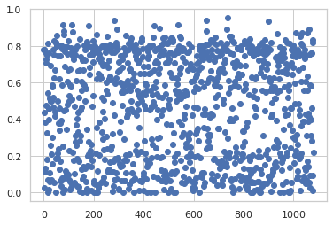
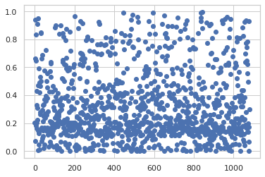

# Code is Law - COMPAS Case Study Impact of design decisions on outcome

### Uses: machine learning, statistical analysis; Backends: pyTorch, scikit-learn

This project looks at the impact of algorithmic design on outcome. The case study is the COMPAS dataset.
COMPAS is a close-source algorithm used by law enforcment to assess the risk of recidivism. That assessment is then used by judges when deciding on jail and imprisonment.

  
This work is on the data science side. It shows that:
1. **Improvement** of the COMPAS accuracy (~68%) is easily **possible**
2. COMPAS is **biased by design** or maybe because of the design
3. Different **presentation** / context  when the result is given **changes its meaning**
4. The **normative underpinnings are key** but are not obvious
5. Code *is* law!
 
 

## Introduction
COMPAS is an algorithm used by law enforcment in different US states to predict different kinds of ''risks''
for individuals who were apprehended for crimes. One of those scores is the so-called ''Risk of Recidivism''.
The predicted score is then given to judges during deliberations on granting/denying parole
and deciding on imprisonment vs. parole. However, the algorithm is designed by Northpointe/Equivant and thus a corporate secret
making it imperative to look at it more closely as its impact is large.

The COMPAS dataset was acquired by ProPublica through a freedom of information request made
on behalf of defendants (The total dimensionality of the data is [12366,37]). The algorithm as well as its trainign data
is private property of Northpointe/Equivant and a corporate secret.

For these defendants, we have a set of variables - however, there is missing information.
Moreover, we also have the ground truth on whether they recivdivated within two years.
That is also the time frame for which COMPAS is claimed to be predictive.
 
 
The main issue, however, is that the dataset by ProPublica is only available in closed source,
meaning we have the raw data as well as the final variables they constructed but not their code.
Consequently, we do not know how they arrived at their result for the recidivism variable and others,
such as count of misdemeanours.
For that reason, we use the offense data scraped by Rudin et al. (2020) and their code from their
[github](https://github.com/beauCoker/age_of_unfairness), which we adapt slightly.
 
 
## Preparing the initial Data
We take the raw data from [ProPublica](https://github.com/propublica/compas-analysis/)
and analyze it using the (slightly adapted) R code by Rudin et al. (2020)

Now that we merged the raw data about priors as well as the individual COMPAS assessment,
we can finally make our dataset. However, here we drop many people, as they have missing
information (for a detailed overview, look into the R-script ''data_to_features.R'')

    [1] 0

Now we go for the actual analyis. For our analyis, we use the dataset '\*\_reduced_size.csv',
as that has no missing values and all the information we need.

    The autoreload extension is already loaded. To reload it, use:
      %reload_ext autoreload

## Dataset and Preprocessing
The preprocessing, e.g., normalization, standardization, or construction of additional variables, is done by
calling on the externally defined Data_set class and its setup_data() function.

    The maximum score (f1_score) is 0.5800327332242227
    The cutoff selected is 2
    use iterative marker...
    done with setting up the data set...

## Data Introspection
Let us first have a look at how our data is structured, i.e., just the baselines
before we move on.

    Shape of X: (5759, 44)

<table border="1" class="dataframe">
  <thead>
    <tr style="text-align: right;">
      <th></th>
      <th>offenses_within_30</th>
      <th>p_felony_count_person</th>
      <th>p_misdem_count_person</th>
      <th>p_charge_violent</th>
      <th>p_current_age</th>
      <th>p_age_first_offense</th>
      <th>p_juv_fel_count</th>
      <th>p_felprop_violarrest</th>
      <th>p_murder_arrest</th>
      <th>p_felassault_arrest</th>
      <th>p_misdemassault_arrest</th>
      <th>p_sex_arrest</th>
      <th>p_weapons_arrest</th>
      <th>p_n_on_probation</th>
      <th>p_current_on_probation</th>
      <th>p_prob_revoke</th>
      <th>p_arrest</th>
      <th>p_jail30</th>
      <th>p_prison30</th>
      <th>p_prison</th>
      <th>p_probation</th>
      <th>is_misdem</th>
      <th>recid_corr</th>
      <th>recid_violent_corr</th>
      <th>custody_days_jail</th>
      <th>custody_days_jail_viol</th>
      <th>jail_sentences</th>
      <th>jail_sentences_viol</th>
      <th>custody_days_prison</th>
      <th>prison_sentences</th>
      <th>custody_days_prison_viol</th>
      <th>prison_sentences_viol</th>
      <th>race_white</th>
      <th>race_hispanic</th>
      <th>race_asian</th>
      <th>race_native</th>
      <th>is_married</th>
      <th>is_divorced</th>
      <th>is_widowed</th>
      <th>is_separated</th>
      <th>is_sig_other</th>
      <th>is_marit_unknown</th>
      <th>is_male</th>
    </tr>
    <tr>
      <th>race_black</th>
      <th></th>
      <th></th>
      <th></th>
      <th></th>
      <th></th>
      <th></th>
      <th></th>
      <th></th>
      <th></th>
      <th></th>
      <th></th>
      <th></th>
      <th></th>
      <th></th>
      <th></th>
      <th></th>
      <th></th>
      <th></th>
      <th></th>
      <th></th>
      <th></th>
      <th></th>
      <th></th>
      <th></th>
      <th></th>
      <th></th>
      <th></th>
      <th></th>
      <th></th>
      <th></th>
      <th></th>
      <th></th>
      <th></th>
      <th></th>
      <th></th>
      <th></th>
      <th></th>
      <th></th>
      <th></th>
      <th></th>
      <th></th>
      <th></th>
      <th></th>
    </tr>
  </thead>
  <tbody>
    <tr>
      <th>0</th>
      <td>0.0</td>
      <td>0.65</td>
      <td>0.50</td>
      <td>0.71</td>
      <td>0.0</td>
      <td>0.0</td>
      <td>0.99</td>
      <td>0.87</td>
      <td>1.00</td>
      <td>0.92</td>
      <td>0.89</td>
      <td>1.00</td>
      <td>0.97</td>
      <td>0.92</td>
      <td>0.97</td>
      <td>0.96</td>
      <td>0.55</td>
      <td>1.00</td>
      <td>1.00</td>
      <td>0.93</td>
      <td>0.75</td>
      <td>0.56</td>
      <td>0.69</td>
      <td>0.87</td>
      <td>0.02</td>
      <td>0.01</td>
      <td>0.02</td>
      <td>0.01</td>
      <td>0.97</td>
      <td>0.97</td>
      <td>0.96</td>
      <td>0.96</td>
      <td>0.0</td>
      <td>1.0</td>
      <td>1.0</td>
      <td>1.0</td>
      <td>0.87</td>
      <td>0.92</td>
      <td>0.99</td>
      <td>0.98</td>
      <td>0.97</td>
      <td>1.0</td>
      <td>0.22</td>
    </tr>
    <tr>
      <th>1</th>
      <td>0.0</td>
      <td>0.50</td>
      <td>0.34</td>
      <td>0.55</td>
      <td>0.0</td>
      <td>0.0</td>
      <td>0.95</td>
      <td>0.74</td>
      <td>0.99</td>
      <td>0.85</td>
      <td>0.83</td>
      <td>0.99</td>
      <td>0.93</td>
      <td>0.80</td>
      <td>0.94</td>
      <td>0.94</td>
      <td>0.40</td>
      <td>0.99</td>
      <td>0.99</td>
      <td>0.84</td>
      <td>0.64</td>
      <td>0.70</td>
      <td>0.57</td>
      <td>0.80</td>
      <td>0.03</td>
      <td>0.02</td>
      <td>0.03</td>
      <td>0.02</td>
      <td>0.93</td>
      <td>0.93</td>
      <td>0.90</td>
      <td>0.90</td>
      <td>1.0</td>
      <td>1.0</td>
      <td>1.0</td>
      <td>1.0</td>
      <td>0.91</td>
      <td>0.98</td>
      <td>1.00</td>
      <td>0.98</td>
      <td>0.97</td>
      <td>1.0</td>
      <td>0.17</td>
    </tr>
  </tbody>
</table>

On the X side:
- For most variables in the dataset there is no difference between individuals
- Most variables regarding priors, we have a high percentage of zero-entries
- We have all relevant hard-facts from Boward County -> COMPAS should not have too great of a variance

For the output-side (y), we have the following columns:

    array(['Unnamed: 0', 'Risk of Failure to Appear_decile_score',
           'Risk of Failure to Appear_raw_score',
           'Risk of Failure to Appear_score_text',
           'Risk of Recidivism_decile_score', 'Risk of Recidivism_raw_score',
           'Risk of Recidivism_score_text', 'Risk of Violence_decile_score',
           'Risk of Violence_raw_score', 'Risk of Violence_score_text',
           'recid', 'recid_violent', 'recid_proPub', 'recid_violent_proPub',
           'Risk of Recidivism_decile_score/10',
           'Risk of Violence_decile_score/10', 'target_error_regression_base',
           'target_error_regression_viol',
           'Risk of Recidivism_raw_to_decile_score',
           'Risk of Violence_raw_to_decile_score'], dtype=object)

For those, most are focused on some risk score. We **focus on risk of recidivism**.

Our three y-variables of interes are:
- 'recid' -> ground truth of recidivism within 2 years
- 'Risk of Recidivism_raw_score' -> most likely COMPAS model output
- 'Risk of Recidivism_decile_score'

The last score is what judges get to see. That means it is very important and may majorly influence outcome.

#### How the decile score is constructed:
The company has six norm groups differing by some age brackets, gender and hard-fat priors such as offenses and combinations
of these attributes. Alternatively, the whole populace may be used as norm group. Then the decile bins are constructed in such a way that each bin holds 10% of the norm group's indivudals.
We now face the following problems:
- Unkown which norm groups the officers applied to create the indivudal decile scores
- Unkown which combinations of parameters would make a valid norm group.

Only thing we know -> construct deciles such that whole dataset (representative of populace) is the norm group. So we do that!

## What the decile...
Now we plot the raw scores, i.e., the COMPAS model output over the transformed scores, i.e. the decile scores, to see how they map.

    

    

- Compared to the input, obviously, there is variance - quite a bit even
- The decile *original* scores (blue) are not only spread out, they are *overlapping*, i.e. on raw score points to different decile scores
- **Individuals with the same raw score** land in **different decile scores**
- Applying the dataset as norm group (green): Reduced but still existent overlap

Remember: *Judges see decile scores*! That means they see the *same decile* scores for individuals with *different* predicted risk
of recidivism *raw scores*. It is also unclear whether they get to know the norm group at all... 
Moreover, what we see nicely here, is how the norm group shifts perceived dangerousness.
That makes the decile score seem somewhat arbitrary.

Let's look at the distribution of the (original) decile scores:

    

    

That figure gets the message across what a decile score is - in essence, the norm group always has uniform distribution!

That means:
- The decile score reflects the dangerousness compared to the norm group
- A comparison between individuals of two norm groups is simply not possible (explains overlap of boundaries in prev. figure)
- Norming against the whole dataset means a right-shift in decile scores but a reduction of overlap in raw scores and different deciles

## Young & Wild & Jailed
Now, we look at (vulnerable) subgroups. Let's start with age:

<table border="1" class="dataframe">
  <thead>
    <tr style="text-align: right;">
      <th></th>
      <th>p_current_age</th>
    </tr>
    <tr>
      <th>race_black</th>
      <th></th>
    </tr>
  </thead>
  <tbody>
    <tr>
      <th>0</th>
      <td>35.133299</td>
    </tr>
    <tr>
      <th>1</th>
      <td>29.539980</td>
    </tr>
  </tbody>
</table>

Do you see the correlation? Young people are also black.
However, first we will stick with age. From here on, we *use the decile scores generated by norming against the
whole dataset* - these are more meaningful in our context as they are more closely related to the distribution of raw scores
whitin the dataset (and also because we actually know where they come from...)

    {'<=21': 'darkred', '21<a<=30': 'darkolivegreen', '30<a<=40': 'navy', '40<a<=50': 'slategrey', '50<a<=65': 'darkorange', 'a>65': 'darkslateblue'}
    The Chi-Squared p-value non_recid is 0.0
    The Chi-Squared p-value non_recid black vs. white is 0.0

    

    

    The Chi-Squared p-value recid is 0.0
    The Chi-Squared p-value recid black vs. white is 0.0

    

    

    The Chi-Squared p-value all is 0.0
    The Chi-Squared p-value all black vs. white is 0.0

    

    

We see that there are large differences between age groups.
- Young people (<=30) are much more likely to get higher decile scores when innocent
- Older people are always in the lowest deciles  
-> Bias on age

    The KL-Divergence overall is 0.10820830391417197
    The KL-Divergence for Non-Recidivists is 0.10079821012920274
    The KL-Divergence for Recidivists is 0.08837028408852377

    

    

And, unsurprsingly, when plotting the precentage of people over age brackets with respect to skin color, we find that
black people are younger. The KL-difference shows us this result in numbers.

We also see, that while blacks are younger for recidivists and non-recidivists when compared to white defendants,
black recidivists are on average younger than black non-recidivists. For white individuals, that difference is less pronounced.
Below, we can see that the correlation is also reflected when plotting directly over deciles:

    

    

We also see
- A clear trend for black recidivists
- That the trend is not as clear for white individuals
- Basically an inverse pattern for the groups white and black
- The data holds more white non-recidivists and moe black recidivists

The question, however, is how the raw scores are distributed in the dataset as then we can see their relationship to
decile scores more closely.

## Raw Insights

    

    

We see the actual distribution of raw scares overlayed with a normal distribution of slightly shifted mean and scale.

First, our scores seem to be approximately norammly distributed. However, while we know that the raw scores *are ordered*,
we do *not know the scale*.

Assuming that our minimum is close to the global minimum and that the same holds for the maximum, we can assume
that the minimum corresponds to a risk/probability of recidivism of 0% and a 100% respectively.
But what about the intermediate values?

When looking at the raw score values more closely, we see that:
- They are comprised of positive and negative values
- The mean is a neighbour of 0
- We know that they are somehow related to risk/probability

In the literature, some researchers found that a lgositic regression is a good approx. of COMPAS. Moreover, a logistic
function/sigmoid is also the most common one for transforming raw output to probabilities

### Reconstructing the Implicit Probabilities
First, lets look at how the sigmoid transformation would look like in terms of estimated risk/probability values:

    

    

So we see, that for all available raw scores, we get probabilities of 0 as well intermediate ones. 
Interestingly though, we do not have individuals in the dataset with a risk of recidivism above 97%.
If you think about what that means, it is actually not that unreasonable. 
Let us look at the transformed distribution next and let us overlay it with another shifted bell curve:

    

    

As most of our raw scores lie below 0, we get a left-skewed dsitribution as a result. Still, that is reasonable.
It is not far-fetched to assume that most people are actually not that dangerous and thus the risk for recidivism is below 50%.
However, that begs the question of who should then be jailed/imprisoned.

Here, we come to the normative aspect: The judges decide who to release or jail. And that brings us back to
the decile scores:
1. Judges see the decile scores only
2. The decile score assigned relies on a norm group and thus on a a special partitioning of the data
3. The paritioning influences what implicit risk/probability a decile bin corresponds to

### How does different decile partitioning affect the implicit decile-risk relationship?
To see this, we apply different ways to partition the raw scores into deciles.
To get the upper boundary for each decile, we look at the highgest raw score in the decile bin and calculate the
implicit ris/probability.

We decide on 3 obvious ways
to partition the data:
- The norm group binning
- Splitting the raw score range linearilly into 10 equally spaced bins
- Splitting the probability range into 10 equally spaced bins

<table border="1" class="dataframe">
  <thead>
    <tr>
      <th>Binning Strategy</th>
      <th colspan="2" halign="left">COMPAS</th>
      <th colspan="2" halign="left">linear cuts raw</th>
      <th colspan="2" halign="left">lin cuts prob</th>
    </tr>
    <tr>
      <th></th>
      <th>Raw Score</th>
      <th>Implicit Prob.</th>
      <th>Raw Score</th>
      <th>Implicit Prob.</th>
      <th>Raw Score</th>
      <th>Implicit Prob.</th>
    </tr>
  </thead>
  <tbody>
    <tr>
      <th>0</th>
      <td>-1.92</td>
      <td>0.128</td>
      <td>-3.63</td>
      <td>0.03</td>
      <td>-2.12</td>
      <td>0.11</td>
    </tr>
    <tr>
      <th>1</th>
      <td>-1.50</td>
      <td>0.182</td>
      <td>-2.86</td>
      <td>0.05</td>
      <td>-1.37</td>
      <td>0.20</td>
    </tr>
    <tr>
      <th>2</th>
      <td>-1.20</td>
      <td>0.231</td>
      <td>-2.09</td>
      <td>0.11</td>
      <td>-0.86</td>
      <td>0.30</td>
    </tr>
    <tr>
      <th>3</th>
      <td>-0.93</td>
      <td>0.283</td>
      <td>-1.32</td>
      <td>0.21</td>
      <td>-0.43</td>
      <td>0.39</td>
    </tr>
    <tr>
      <th>4</th>
      <td>-0.69</td>
      <td>0.334</td>
      <td>-0.54</td>
      <td>0.37</td>
      <td>-0.05</td>
      <td>0.49</td>
    </tr>
    <tr>
      <th>5</th>
      <td>-0.47</td>
      <td>0.385</td>
      <td>0.23</td>
      <td>0.56</td>
      <td>0.34</td>
      <td>0.58</td>
    </tr>
    <tr>
      <th>6</th>
      <td>-0.23</td>
      <td>0.443</td>
      <td>1.00</td>
      <td>0.73</td>
      <td>0.75</td>
      <td>0.68</td>
    </tr>
    <tr>
      <th>7</th>
      <td>0.02</td>
      <td>0.505</td>
      <td>1.78</td>
      <td>0.86</td>
      <td>1.23</td>
      <td>0.77</td>
    </tr>
    <tr>
      <th>8</th>
      <td>0.37</td>
      <td>0.591</td>
      <td>2.55</td>
      <td>0.93</td>
      <td>1.90</td>
      <td>0.87</td>
    </tr>
    <tr>
      <th>9</th>
      <td>1.69</td>
      <td>0.844</td>
      <td>3.32</td>
      <td>0.97</td>
      <td>3.32</td>
      <td>0.97</td>
    </tr>
  </tbody>
</table>

As we can see, depending on the binning strategy, the judge jails completely different risk profiles for the same decile score.
 That is why making the implicit assumptions and implications hidden in the decile score is key - the normative implications are great!

Let us compare for an often proposed and used threshold of 3. *For the original COMPAS binning* strategy, every person above
an *implicit risk 28.3%* would be potentially *jailed/imprisoned*. 
For the linear raw binning, we would jail already at 21% 
And finally, for the linear probability cuts, we would jail only at 40%. 
So only for the last binning strategy do the deciles directly translate to an estimated risk score.

Moreover, the original binning means that in therms of raw score, the bin width changes. The most narrow bin is only 0.22 wide. 
In comparison, the widest bin is 1.32.
The impact of binning strategy on width can also be nicely illustrated with the following plots. A linear raw score binning euqals
a shifting bin width in the risk (as evident from the change in gradient) and vis-a-versa. 
In comparison, the COMPAS binning already looks somewhat random.

    

    

That information is also hidden from the judge.

The question now is: Why? Is there a reason or is it a random decision?

## The People vs. The Threshold
Now that we looked at how the binning affects the decile score, lets look at how choosing a certain decile threshold
for which to jail affects the errors a judge/COMPAS makes.
Moreover, we *also train a small neuronal net*.

The goal of the net is to recognize errors given the threshold. To that end, the net is given the Xvariables excluding
race as input (as COMPAS does also not get that variable).
Moreover, we also give the net the information about COMPAS predicts the individual to be a recidivists given the threshold.
The model aims to optimizie accuracy and the error is the RSME.
(Full specifications may be found in the paper.)

    
Click to expand for training results!

    Do training for linear_cuts
    for cutoff 0
    ['True Pos.' 'False Pos.' 'True Neg.' 'False Neg.']
    [0.34798478 0.65152522 0.         0.        ]
    use iterative marker...
    ['race_black', 'race_white', 'race_hispanic', 'race_asian', 'race_native']

    

    

    0.6777777777777778
    Number of COMPAS correct ones 514
    Total number of correct ones: 976.0
    0.6833333333333333
    Number of COMPAS correct ones 381
    Total number of correct ones: 738.0
    #####################################
    for cutoff 1
    ['True Pos.' 'False Pos.' 'True Neg.' 'False Neg.']
    [3.47621592e-01 6.43458408e-01 8.06680815e-03 3.63191853e-04]
    use iterative marker...
    ['race_black', 'race_white', 'race_hispanic', 'race_asian', 'race_native']

    

    

    0.6708333333333333
    Number of COMPAS correct ones 518
    Total number of correct ones: 966.0
    0.6898148148148148
    Number of COMPAS correct ones 383
    Total number of correct ones: 745.0
    #####################################
    for cutoff 2
    ['True Pos.' 'False Pos.' 'True Neg.' 'False Neg.']
    [0.34274438 0.59141562 0.0601096  0.0052404 ]
    use iterative marker...
    ['race_black', 'race_white', 'race_hispanic', 'race_asian', 'race_native']

    

    

    0.6534722222222222
    Number of COMPAS correct ones 594
    Total number of correct ones: 941.0
    0.6833333333333333
    Number of COMPAS correct ones 451
    Total number of correct ones: 738.0
    #####################################
    for cutoff 3
    ['True Pos.' 'False Pos.' 'True Neg.' 'False Neg.']
    [0.31187632 0.43281368 0.21871153 0.03610847]
    use iterative marker...
    ['race_black', 'race_white', 'race_hispanic', 'race_asian', 'race_native']

    

    

    0.6618055555555555
    Number of COMPAS correct ones 764
    Total number of correct ones: 953.0
    0.6842592592592592
    Number of COMPAS correct ones 575
    Total number of correct ones: 739.0
    #####################################
    for cutoff 4
    ['True Pos.' 'False Pos.' 'True Neg.' 'False Neg.']
    [0.2179938  0.1993062  0.45221901 0.12999099]
    use iterative marker...
    ['race_black', 'race_white', 'race_hispanic', 'race_asian', 'race_native']

    

    

    0.6868055555555556
    Number of COMPAS correct ones 922
    Total number of correct ones: 989.0
    0.7101851851851851
    Number of COMPAS correct ones 696
    Total number of correct ones: 767.0
    #####################################
    for cutoff 5
    ['True Pos.' 'False Pos.' 'True Neg.' 'False Neg.']
    [0.09337162 0.04830838 0.60321684 0.25461316]
    use iterative marker...
    ['race_black', 'race_white', 'race_hispanic', 'race_asian', 'race_native']

    

    

    0.6708333333333333
    Number of COMPAS correct ones 970
    Total number of correct ones: 966.0
    0.6805555555555556
    Number of COMPAS correct ones 725
    Total number of correct ones: 735.0
    #####################################
    for cutoff 6
    ['True Pos.' 'False Pos.' 'True Neg.' 'False Neg.']
    [0.02151168 0.00581832 0.64570689 0.32647311]
    use iterative marker...
    ['race_black', 'race_white', 'race_hispanic', 'race_asian', 'race_native']

    

    

    0.6680555555555555
    Number of COMPAS correct ones 937
    Total number of correct ones: 962.0
    0.6861111111111111
    Number of COMPAS correct ones 704
    Total number of correct ones: 741.0
    #####################################
    for cutoff 7
    ['True Pos.' 'False Pos.' 'True Neg.' 'False Neg.']
    [2.25520033e-03 2.94799671e-04 6.51230417e-01 3.45729583e-01]
    use iterative marker...
    ['race_black', 'race_white', 'race_hispanic', 'race_asian', 'race_native']

    

    

    0.68125
    Number of COMPAS correct ones 926
    Total number of correct ones: 981.0
    0.6953703703703704
    Number of COMPAS correct ones 699
    Total number of correct ones: 751.0
    #####################################
    for cutoff 8
    ['True Pos.' 'False Pos.' 'True Neg.' 'False Neg.']
    [1.50418431e-04 9.58156886e-06 6.51515635e-01 3.47834365e-01]
    use iterative marker...
    ['race_black', 'race_white', 'race_hispanic', 'race_asian', 'race_native']

    

    

    0.6652777777777777
    Number of COMPAS correct ones 926
    Total number of correct ones: 958.0
    0.6833333333333333
    Number of COMPAS correct ones 699
    Total number of correct ones: 738.0
    #####################################
    for cutoff 9
    ['True Pos.' 'False Pos.' 'True Neg.' 'False Neg.']
    [9.65108591e-06 3.48914085e-07 6.51524868e-01 3.47975132e-01]
    use iterative marker...
    ['race_black', 'race_white', 'race_hispanic', 'race_asian', 'race_native']

    

    

    0.68125
    Number of COMPAS correct ones 926
    Total number of correct ones: 981.0
    0.687962962962963
    Number of COMPAS correct ones 699
    Total number of correct ones: 743.0
    #####################################
    Do training for cutoffs_lin_prob
    for cutoff 0
    ['True Pos.' 'False Pos.' 'True Neg.' 'False Neg.']
    [0.34317602 0.59497398 0.         0.        ]
    use iterative marker...
    ['race_black', 'race_white', 'race_hispanic', 'race_asian', 'race_native']

    

    

    0.6659722222222222
    Number of COMPAS correct ones 590
    Total number of correct ones: 959.0
    0.6916666666666667
    Number of COMPAS correct ones 448
    Total number of correct ones: 747.0
    #####################################
    for cutoff 1
    ['True Pos.' 'False Pos.' 'True Neg.' 'False Neg.']
    [0.31555216 0.44698784 0.14798614 0.02762386]
    use iterative marker...
    ['race_black', 'race_white', 'race_hispanic', 'race_asian', 'race_native']

    

    

    0.6722222222222223
    Number of COMPAS correct ones 746
    Total number of correct ones: 968.0
    0.6731481481481482
    Number of COMPAS correct ones 561
    Total number of correct ones: 727.0
    #####################################
    for cutoff 2
    ['True Pos.' 'False Pos.' 'True Neg.' 'False Neg.']
    [0.2648638  0.2940262  0.30094778 0.07831222]
    use iterative marker...
    ['race_black', 'race_white', 'race_hispanic', 'race_asian', 'race_native']

    

    

    0.6715277777777777
    Number of COMPAS correct ones 868
    Total number of correct ones: 967.0
    0.6712962962962963
    Number of COMPAS correct ones 658
    Total number of correct ones: 725.0
    #####################################
    for cutoff 3
    ['True Pos.' 'False Pos.' 'True Neg.' 'False Neg.']
    [0.19990325 0.16976675 0.42520724 0.14327276]
    use iterative marker...
    ['race_black', 'race_white', 'race_hispanic', 'race_asian', 'race_native']

    

    

    0.6770833333333334
    Number of COMPAS correct ones 926
    Total number of correct ones: 975.0
    0.6907407407407408
    Number of COMPAS correct ones 720
    Total number of correct ones: 746.0
    #####################################
    for cutoff 4
    ['True Pos.' 'False Pos.' 'True Neg.' 'False Neg.']
    [0.13634801 0.08799199 0.50698199 0.20682801]
    use iterative marker...
    ['race_black', 'race_white', 'race_hispanic', 'race_asian', 'race_native']

    

    

    0.6659722222222222
    Number of COMPAS correct ones 960
    Total number of correct ones: 959.0
    0.6768518518518518
    Number of COMPAS correct ones 738
    Total number of correct ones: 731.0
    #####################################
    for cutoff 5
    ['True Pos.' 'False Pos.' 'True Neg.' 'False Neg.']
    [0.07857674 0.03711326 0.55786072 0.26459928]
    use iterative marker...
    ['race_black', 'race_white', 'race_hispanic', 'race_asian', 'race_native']

    

    

    0.6652777777777777
    Number of COMPAS correct ones 963
    Total number of correct ones: 958.0
    0.6953703703703704
    Number of COMPAS correct ones 720
    Total number of correct ones: 751.0
    #####################################
    for cutoff 6
    ['True Pos.' 'False Pos.' 'True Neg.' 'False Neg.']
    [0.03748792 0.01258208 0.5823919  0.3056881 ]
    use iterative marker...
    ['race_black', 'race_white', 'race_hispanic', 'race_asian', 'race_native']

    

    

    0.6694444444444444
    Number of COMPAS correct ones 949
    Total number of correct ones: 964.0
    0.6944444444444444
    Number of COMPAS correct ones 710
    Total number of correct ones: 750.0
    #####################################
    for cutoff 7
    ['True Pos.' 'False Pos.' 'True Neg.' 'False Neg.']
    [0.01172076 0.00255924 0.59241474 0.33145526]
    use iterative marker...
    ['race_black', 'race_white', 'race_hispanic', 'race_asian', 'race_native']

    

    

    0.675
    Number of COMPAS correct ones 928
    Total number of correct ones: 972.0
    0.6962962962962963
    Number of COMPAS correct ones 698
    Total number of correct ones: 752.0
    #####################################
    for cutoff 8
    ['True Pos.' 'False Pos.' 'True Neg.' 'False Neg.']
    [1.48725592e-03 1.72744080e-04 5.94801240e-01 3.41688760e-01]
    use iterative marker...
    ['race_black', 'race_white', 'race_hispanic', 'race_asian', 'race_native']

    

    

    0.6638888888888889
    Number of COMPAS correct ones 926
    Total number of correct ones: 956.0
    0.6805555555555556
    Number of COMPAS correct ones 699
    Total number of correct ones: 735.0
    #####################################
    for cutoff 9
    ['True Pos.' 'False Pos.' 'True Neg.' 'False Neg.']
    [9.65108591e-06 3.48914085e-07 5.94973635e-01 3.43166365e-01]
    use iterative marker...
    ['race_black', 'race_white', 'race_hispanic', 'race_asian', 'race_native']

    

    

    0.6722222222222223
    Number of COMPAS correct ones 926
    Total number of correct ones: 968.0
    0.6768518518518518
    Number of COMPAS correct ones 699
    Total number of correct ones: 731.0
    #####################################
    Do training for compas_cuts
    for cutoff 0
    ['True Pos.' 'False Pos.' 'True Neg.' 'False Neg.']
    [0.33952914 0.56751086 0.         0.        ]
    use iterative marker...
    ['race_black', 'race_white', 'race_hispanic', 'race_asian', 'race_native']

    

    

    0.6743055555555556
    Number of COMPAS correct ones 622
    Total number of correct ones: 971.0
    0.6842592592592592
    Number of COMPAS correct ones 465
    Total number of correct ones: 739.0
    #####################################
    for cutoff 1
    ['True Pos.' 'False Pos.' 'True Neg.' 'False Neg.']
    [0.32363984 0.48106016 0.0864507  0.0158893 ]
    use iterative marker...
    ['race_black', 'race_white', 'race_hispanic', 'race_asian', 'race_native']

    

    

    0.6611111111111111
    Number of COMPAS correct ones 710
    Total number of correct ones: 952.0
    0.6685185185185185
    Number of COMPAS correct ones 535
    Total number of correct ones: 722.0
    #####################################
    for cutoff 2
    ['True Pos.' 'False Pos.' 'True Neg.' 'False Neg.']
    [0.30193585 0.39761415 0.1698967  0.0375933 ]
    use iterative marker...
    ['race_black', 'race_white', 'race_hispanic', 'race_asian', 'race_native']

    

    

    0.6763888888888889
    Number of COMPAS correct ones 790
    Total number of correct ones: 974.0
    0.6851851851851852
    Number of COMPAS correct ones 590
    Total number of correct ones: 740.0
    #####################################
    for cutoff 3
    ['True Pos.' 'False Pos.' 'True Neg.' 'False Neg.']
    [0.27372344 0.31580656 0.25170429 0.06580571]
    use iterative marker...
    ['race_black', 'race_white', 'race_hispanic', 'race_asian', 'race_native']

    

    

    0.6722222222222223
    Number of COMPAS correct ones 853
    Total number of correct ones: 968.0
    0.6833333333333333
    Number of COMPAS correct ones 644
    Total number of correct ones: 738.0
    #####################################
    for cutoff 4
    ['True Pos.' 'False Pos.' 'True Neg.' 'False Neg.']
    [0.24125764 0.24254236 0.3249685  0.0982715 ]
    use iterative marker...
    ['race_black', 'race_white', 'race_hispanic', 'race_asian', 'race_native']

    

    

    0.6631944444444444
    Number of COMPAS correct ones 919
    Total number of correct ones: 955.0
    0.6583333333333333
    Number of COMPAS correct ones 686
    Total number of correct ones: 711.0
    #####################################
    for cutoff 5
    ['True Pos.' 'False Pos.' 'True Neg.' 'False Neg.']
    [0.20650445 0.18017555 0.38733531 0.13302469]
    use iterative marker...
    ['race_black', 'race_white', 'race_hispanic', 'race_asian', 'race_native']

    

    

    0.6708333333333333
    Number of COMPAS correct ones 932
    Total number of correct ones: 966.0
    0.6898148148148148
    Number of COMPAS correct ones 713
    Total number of correct ones: 745.0
    #####################################
    for cutoff 6
    ['True Pos.' 'False Pos.' 'True Neg.' 'False Neg.']
    [0.1663404  0.1227296  0.44478126 0.17318874]
    use iterative marker...
    ['race_black', 'race_white', 'race_hispanic', 'race_asian', 'race_native']

    

    

    0.6722222222222223
    Number of COMPAS correct ones 963
    Total number of correct ones: 968.0
    0.6796296296296296
    Number of COMPAS correct ones 730
    Total number of correct ones: 734.0
    #####################################
    for cutoff 7
    ['True Pos.' 'False Pos.' 'True Neg.' 'False Neg.']
    [0.12506914 0.07648086 0.49103    0.21446   ]
    use iterative marker...
    ['race_black', 'race_white', 'race_hispanic', 'race_asian', 'race_native']

    

    

    0.6555555555555556
    Number of COMPAS correct ones 962
    Total number of correct ones: 944.0
    0.6805555555555556
    Number of COMPAS correct ones 732
    Total number of correct ones: 735.0
    #####################################
    for cutoff 8
    ['True Pos.' 'False Pos.' 'True Neg.' 'False Neg.']
    [0.07490997 0.03453003 0.53298083 0.26461917]
    use iterative marker...
    ['race_black', 'race_white', 'race_hispanic', 'race_asian', 'race_native']

    

    

    0.6604166666666667
    Number of COMPAS correct ones 965
    Total number of correct ones: 951.0
    0.6898148148148148
    Number of COMPAS correct ones 718
    Total number of correct ones: 745.0
    #####################################
    for cutoff 9
    ['True Pos.' 'False Pos.' 'True Neg.' 'False Neg.']
    [3.12948290e-03 4.50517097e-04 5.67060339e-01 3.36399661e-01]
    use iterative marker...
    ['race_black', 'race_white', 'race_hispanic', 'race_asian', 'race_native']

    

    

    0.6763888888888889
    Number of COMPAS correct ones 926
    Total number of correct ones: 974.0
    0.6851851851851852
    Number of COMPAS correct ones 699
    Total number of correct ones: 740.0
    #####################################

Now that we trained our/loaded our model, we can see that it manages to find a pattern within the data useful for correction.
And, as the binning strategy is so central, its performance varies depending on the binning strategy employed.
Let us compare it directly to COMPAS:

    

    

    

    

    

    

Let us first look at the last figure, directly above.
On the left, we always find the COMPAS performance with respect to the threshold shown on the x-xis.
The y-axis shows the absolute number of people - absolute so that is obvious what the specific trade-off is.

For the proposed literature threshold at 4, COMPAS makes more False Positives than True Positives.
At the second proposed threshold, 7, the trade-off is only marginally better.
In principle, the total number reaches its maximum for the threshold 7. 
That means, for the threshold 4 for which COMPAS already recommends 'supervision', we mainly jail innocents.

Looking at the performance of our correction model, we see that the threshold becomes mostly irrelevant. Moreorver,
we find always more True Positives than False Positives (FP). On the other hand, we also always make more False Negatives (FN)
than TP. That means we find fewer recidivists for jailing  compared to those recidivists we let falsely go.

Hence, our *solution is **not** better* (although accuracy is higher on average). Normatively, we simply *offer another solution
on the pareto front*. That is important, as the *normative underpinnings* of a parliament or a judge *should decide* on the trade-off
between errors (FP vs. FN). COMPAS, however, obscures the fact that the it implicitly makes such a decision as the most accurate result is
achieved when we do not imprison/jail most defendants.

We also see how the different partition/binning strategies affect the trade-off between errors. Dividing the 0-1 range into
equally spaced bins for probability moves the intersection point of TP/FP to a lower threshold, while the number of FN
increases more steeply. The opposite is true for the uniformly spaced raw score bins.

Consequently:
- COMPAS onscures a normative choice for the trade-off between FP and FN.
- The binning strategy obscures another normative trade-off.
- It is possible to invert the FP/FN trade-off with a correction model, i.e. offer another solution on the pareto-front.

Now, we look again at our subgroups and how they are impacted in terms of false positives and false negatives
in order to asses fairness.

    Fairness analyis for binning strategy linear_cuts

    

    

    Fairness analyis for binning strategy cutoffs_lin_prob

    

    

    Fairness analyis for binning strategy compas_cuts

    

    

We see a varying impact of the model on the outcome. While COMPAS is always disfavoring black individuals,
the strength of that effect depends on the binning strategy. As such, the COMPAS binning strategy is acutally the
one disfavoring black individuals most (greatest distance between lines).
On the other hand, the correction model reduces the amount of disfavor. It reduces it most for the COMPAS binning and
least for the uniformly spaced raw score bins.

Overall, it reduces the false positive error rate (in absolutes) wile rising the false negative level. Relatvely,
it reduces disfavor towards black individuals.

    Fairness analyis for binning strategy linear_cuts

    

    

    Fairness analyis for binning strategy cutoffs_lin_prob

    

    

    Fairness analyis for binning strategy compas_cuts

    

    

Looking at our second subgroup analysis (age), we see the same trend, although much more strongly.
The correction model reduces or even eliminates bias gainst young individuals (who happen to be black).
The correction effect is stronger because our model gets an individual's age as input while it does not get race.
As such, we can assume that the COMPAS bias against black individuals stems from the fact that it relies (too) heavily on
the age of an individual.
Our model fixes that witht the caveat that now more recidivists, i.e. future criminals, will run free.

Is that better? That depends on who you ask - but that is the important take-away here: 
It should really be a decision made by society and/or a judge - hence *a **private** company should **not be allowed** to simply make those design decisions.*
